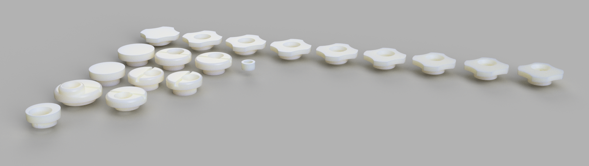

# Ski boot cuff canting inserts/cams for most brands

### Custom cuff inserts/cams for more offset and adjustability

Where files are numbered, indicates offset in mm. Non-numbered files are set to the max offset that the OEM design can tolerate. The Head design using the smaller Lange t-nut is experimental. The dalbello_kids design is for the JR boots (must drill out OEM rivet and provide an OEM Head t-nut and bolt). Lange and Fischer designs are obsolete as of 2022; working with older models. 

## 3d printing instructions
Print in something strong. I prefer CF nylon or CF PC, 100% density. With the right filament and settings, these will last forever and tolerate the harshest of abuse.

I have tried engineering resin (siraya-tech blue + tenacious), however these resins become brittle in the cold and will crack (even at 100% tenacious). FDM is the way to go for this application. 

## Links
Join the tech-ski discord: www.technicalski.com \
My YT channel: https://www.youtube.com/c/nSkier

